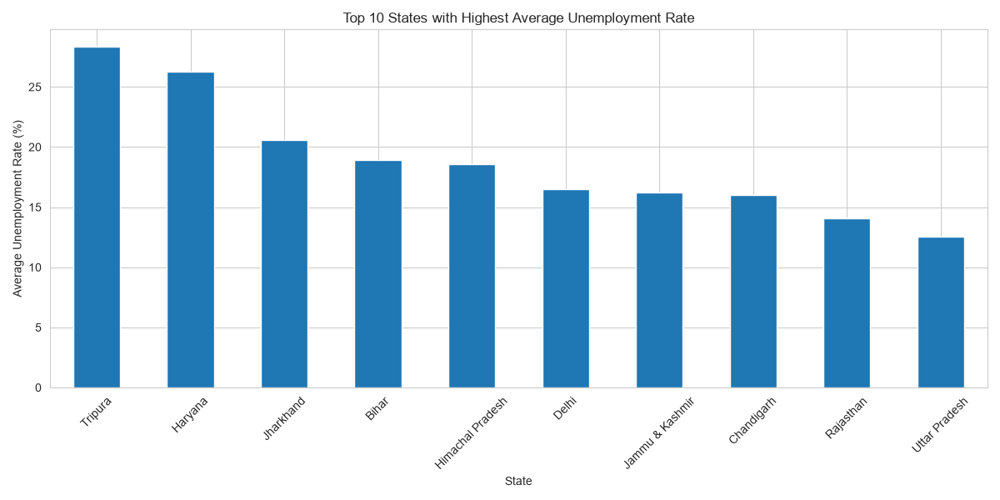
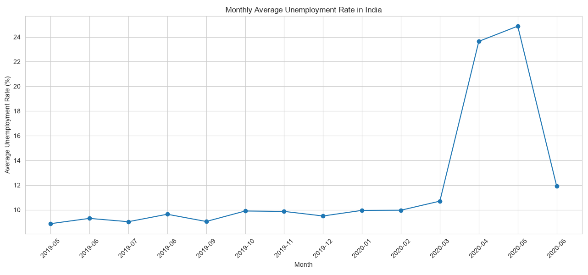
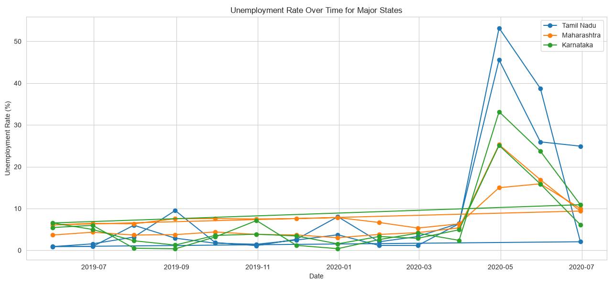
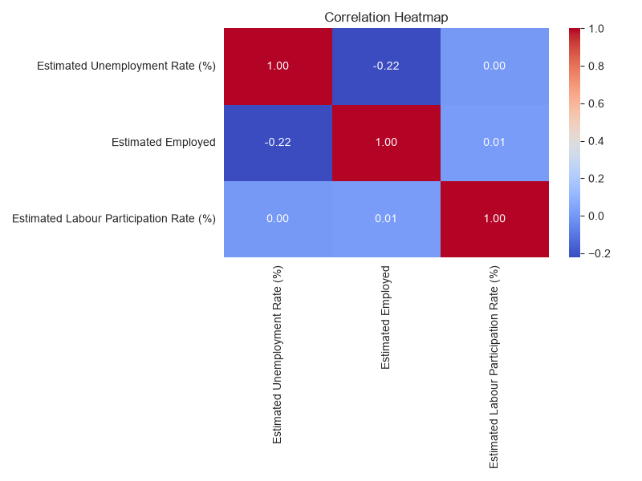
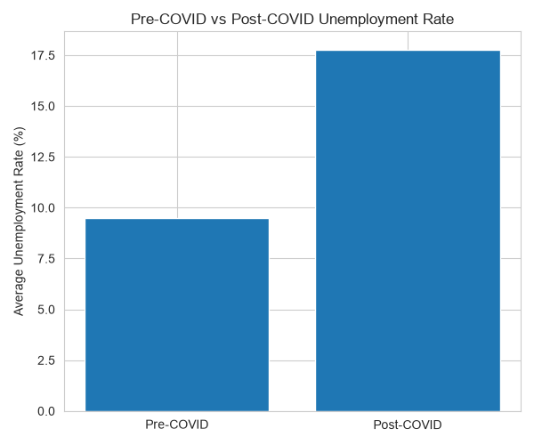

# Unemployment Analysis in India using Python

## Project Objective
The objective of this project is to analyze unemployment trends in India and study the impact of the COVID-19 pandemic using Exploratory Data Analysis (EDA).

## Technologies Used
- Python
- Pandas
- Matplotlib
- Seaborn

## Dataset
Dataset used:
- Unemployment in India Dataset from Kaggle

## Project Workflow
1. Data Loading
2. Data Cleaning
3. Handling Missing Values
4. Type Conversion
5. Exploratory Data Analysis
6. Visualization
7. COVID-19 Impact Analysis

## Visualizations
### Top 10 States with Highest Average Unemployment Rate

### Monthly Unemployment Trend

### Unemployment Trends in Major States

### Correlation Heatmap

### COVID Impact Analysis

## Key Findings
- Significant regional variation exists in unemployment rates.
- The COVID-19 pandemic caused a sharp increase in unemployment.
- Employment and unemployment exhibit a negative correlation.
- Recovery was observed after lockdown restrictions were relaxed.

## Author
Jega